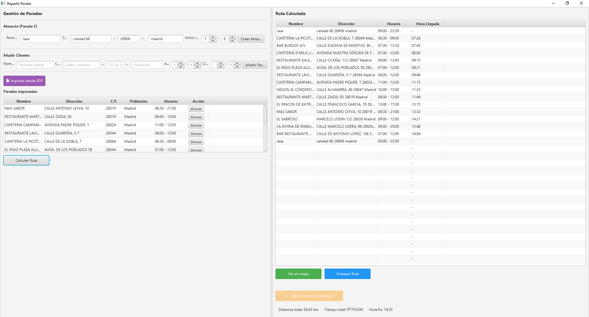
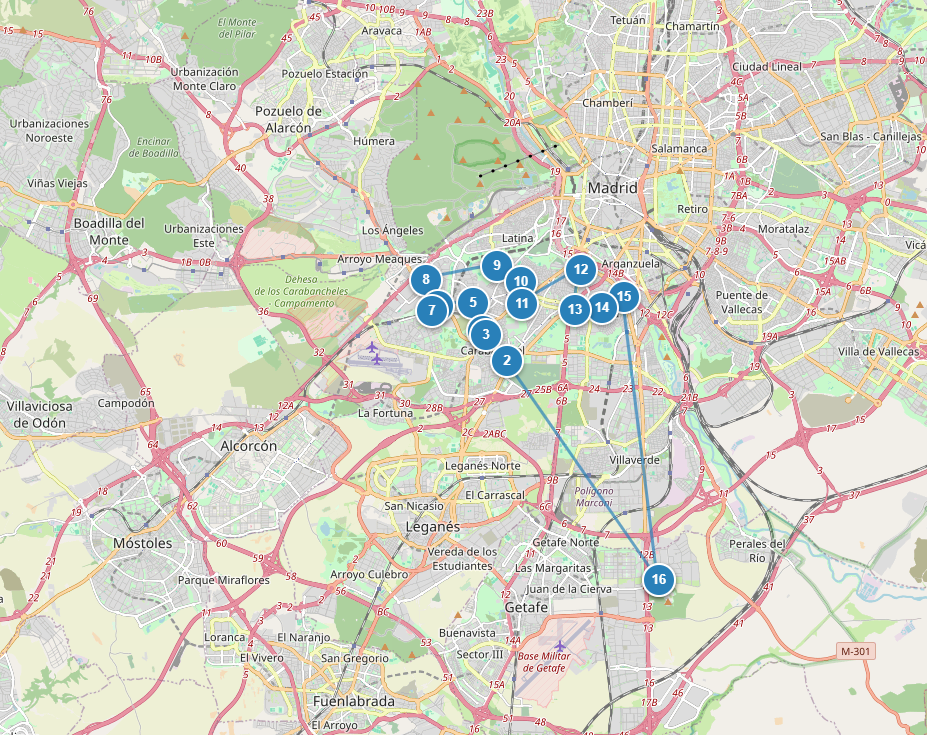
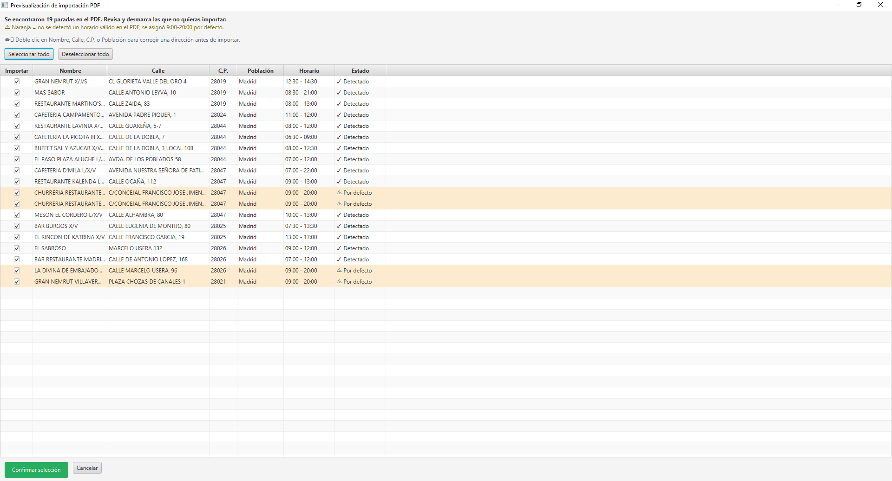

# Reparto Router

Aplicación de escritorio en JavaFX para la optimización de rutas de reparto en Madrid. Permite importar paradas manualmente o desde un PDF, geocodificarlas automáticamente, calcular la ruta más eficiente y visualizarla en un mapa interactivo.

Proyecto desarrollado como trabajo final del ciclo de **Desarrollo de Aplicaciones Multiplataforma (DAM)**, con valor de cara a la **FCT (Formación en Centros de Trabajo)**.

> ⚠️ Este proyecto se publica únicamente con fines de portfolio y evaluación académica. Consulta el archivo [LICENSE](./LICENSE) antes de reutilizar cualquier parte del código.

---

## Capturas de pantalla

**Gestión de paradas y ruta calculada**


**Visualización de la ruta en el mapa (Leaflet)**


**Previsualización de importación desde PDF**


---

## Funcionalidades principales

- **Gestión de paradas**: alta, edición y eliminación de paradas de reparto con dirección, horario de apertura/cierre y datos de contacto.
- **Geocodificación automática**: conversión de direcciones (calle, código postal, población) a coordenadas mediante la API de Nominatim (OpenStreetMap), ejecutada en segundo plano para no bloquear la interfaz.
- **Importación desde PDF**: extracción de paradas directamente desde archivos PDF de reparto usando `tabula-java`, con una ventana de previsualización donde se pueden corregir filas antes de importarlas (incluye resaltado de horas no parseables y geocodificación por lotes).
- **Cálculo de rutas optimizadas**: algoritmo del vecino más cercano como solución inicial, refinado con el algoritmo 2-opt para reducir la distancia total del recorrido.
- **Visualización en mapa**: generación de un mapa interactivo con Leaflet.js, con marcadores numerados y la polilínea de la ruta calculada, servido localmente para evitar las restricciones de seguridad del navegador con archivos locales.
- **Configuración de reparto**: definición de un punto de inicio de ruta ("Inicio ruta") desde el que se calculan todos los trayectos.

---

## Tecnologías utilizadas

| Tecnología                            | Uso                                              |
| ------------------------------------- | ------------------------------------------------ |
| **Java 21**                           | Lenguaje principal                               |
| **JavaFX**                            | Interfaz gráfica de escritorio                   |
| **Maven**                             | Gestión de dependencias y build                  |
| **Nominatim (OpenStreetMap)**         | Geocodificación de direcciones                   |
| **Leaflet.js**                        | Renderizado de mapas interactivos                |
| **tabula-java**                       | Extracción de tablas desde archivos PDF          |
| **com.sun.net.httpserver.HttpServer** | Servidor local embebido para servir el mapa HTML |

---

## Arquitectura del proyecto

```
com.luispacheco.reparto
├── model/              # Parada, Ruta, ConfiguracionReparto, FilaImportada
├── service/             # DistanciaService, GeocodificacionService, HorarioService,
│                        # EnrutadorService, ImportadorPdfService
├── algorithm/           # HeuristicaVecino, AlgoritmoDosOpt
└── ui/                  # VentanaPrincipal, VentanaPrevisualizacionPdf
```

- **`DistanciaService`**: cálculo de distancias entre coordenadas mediante la fórmula de Haversine.
- **`HeuristicaVecino`**: construye una ruta inicial usando el algoritmo del vecino más cercano.
- **`AlgoritmoDosOpt`**: refina la ruta inicial intercambiando segmentos para reducir la distancia total.
- **`GeocodificacionService`**: gestiona las llamadas a Nominatim en hilos `javafx.concurrent.Task`, evitando bloquear la interfaz durante la resolución de direcciones.
- **`ImportadorPdfService`**: extrae filas de paradas desde PDFs usando `tabula-java`, que luego se revisan y corrigen en `VentanaPrevisualizacionPdf` antes de importarlas.

---

## Cómo ejecutar el proyecto

### Requisitos previos

- JDK 21
- Maven
- Conexión a internet (para la geocodificación con Nominatim y la carga de mapas)

### Pasos

```bash
git clone https://github.com/Dev-Junior2026/reparto-router.git
cd reparto-router
mvn clean javafx:run
```

---

## Roadmap / próximos pasos

- [x] Finalizar la funcionalidad "Ir hacia allí" (apertura de Google Maps con la ubicación actual del usuario vía `navigator.geolocation`).
- [ ] Extraer la lógica de negocio a un módulo Maven independiente (`reparto-router-core`), agnóstico de plataforma, como paso previo a una futura versión para Android.

---

## Autor

**Luis Pacheco** ([@Dev-Junior2026](https://github.com/Dev-Junior2026))
Estudiante de DAM (2º curso) — Explora FP, Móstoles, Madrid.
